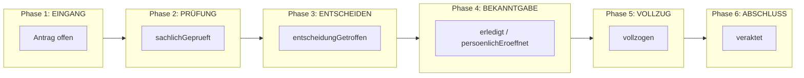
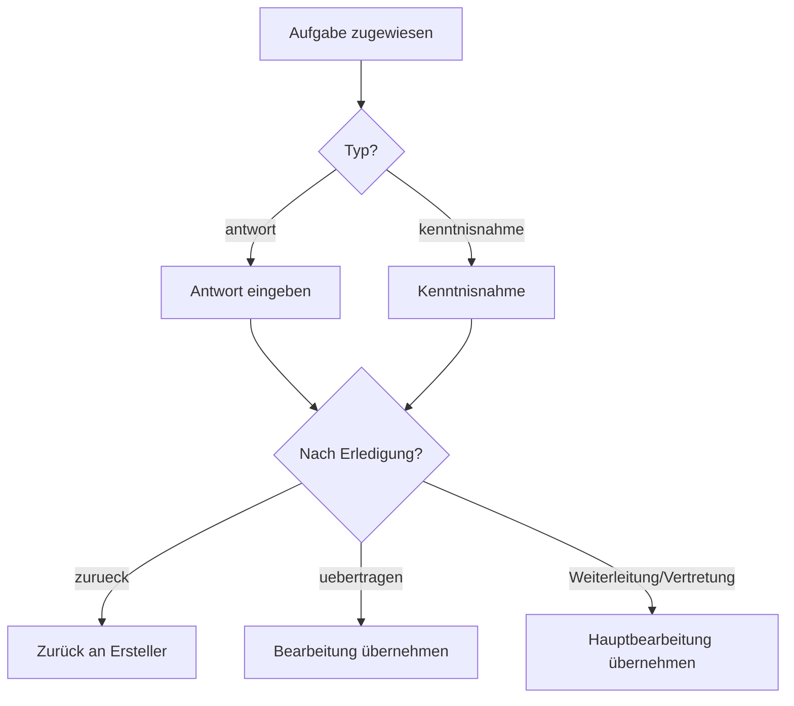
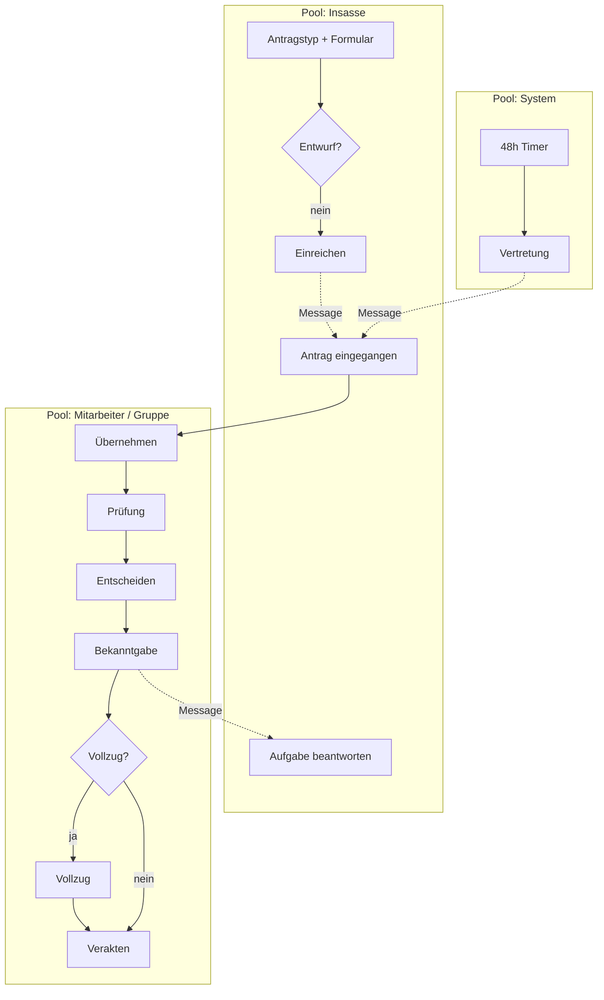

# Lastenheft — Prototyp Justizvollzugsplattform (Antragswesen)

**Stand:** Juni 2026  
**Version:** 1.1 (Prototyp)  
**Basis:** Implementierung in `public/` (Insassen-, Mitarbeiter-, Admin-Portal), `server.js`, `data-sync.js`  
**Zweck:** Vollständige Erfassung aller im Prototyp umgesetzten Anforderungen als Grundlage für Produktentwicklung, Ausschreibung oder Priorisierung. Jede Anforderung enthält bis zu drei testbare Akzeptanzkriterien.

**Begleitdokumente:** `UX-drei-koerper-antraege.md`, `PROZESSMODELL.md`, `docs/antragswesen-phasenmodell.bpmn`

---

## Vorwort: Plattform, Nutzerführung und Prozessüberblick

Dieses Vorwort fasst die **allgemeine Beschreibung** des Prototyps zusammen — bevor die nummerierten Anforderungen folgen. Es beschreibt, *wie* die Plattform aufgebaut ist und *wo* Bearbeitung stattfindet, nicht jede Einzelanforderung im Detail.

### Plattformcharakter

Der Prototyp ist eine webbasierte **Justizvollzugsplattform** mit drei Portalen:

| Portal | Nutzer | Kernaufgabe |
|--------|--------|-------------|
| **Insassen-Portal** | Gefangene | Anträge stellen, Entwürfe pflegen, Aufgaben beantworten, Bescheide einsehen |
| **Mitarbeiter-Portal** | AVD, VAL, Fachgruppen u. a. | Anträge bearbeiten, entscheiden, verakten; Aufgaben und Termine steuern |
| **Admin-Portal** | IT / Verwaltung | Benutzer, Antragstypen, Termine, Backup |

Alle Portale teilen sich eine gemeinsame Domänenlogik (`app.js`) und synchronisieren Daten über `data-sync.js` mit dem Server. Es handelt sich ausdrücklich um einen **Demonstrationsprototyp**, nicht um einen produktionsreifen Betrieb.

### Die drei „Körper“ im Mitarbeiter-Portal

Im Mitarbeiter-Portal gibt es **genau eine sichtbare Hauptfläche** unter dem gemeinsamen Header. Es schaltet zwischen drei Containern um — nicht drei parallele Seiten, sondern **ein Stack**:

```
Header (immer)
  └─ genau EINER von:
       ① jvpHubView          → Plattform-Dashboard
       ② dashboardView       → Antrags-Übersicht (Listen)
       ③ antragDetailView    → ein Antrag im Vollbild
```

| Körper | DOM-ID | Zweck | Navigation hinein | Navigation raus |
|--------|--------|--------|-------------------|-----------------|
| **① Hub** | `jvpHubView` | Orientierung, Kennzahlen, Einstieg in Fachverfahren | Nach Login (Standard) | Kachel „Gefangenenanträge“ → Übersicht |
| **② Übersicht** | `dashboardView` | **Suchen, filtern, zuordnen, leichte Aktionen** auf vielen Vorgängen | Hub-Kachel / KPI-Karte | Header „Zurück zum Dashboard“ → Hub |
| **③ Detail** | `antragDetailView` | **Lesen + vollständig bearbeiten** eines Antrags | Karte „Öffnen“ oder nach Übernahme | „← Zurück zur Übersicht“ → ② |

**Logik:** Hub = *Wo stehe ich, was liegt an?* — Übersicht = *Welcher Vorgang ist dran?* — Detail = *Was steht im Antrag, was ist der nächste Schritt?*

#### Körper ① — Hub (`jvpHubView`)

**Rolle:** Plattform, **kein** Antragsbearbeiten.

Aufbau (von oben nach unten):

1. **Drei Kennzahl-Karten** — aggregierte Zahlen (meine Anträge, Meldungen, überfällig); die Antrags-Karte springt in die Übersicht.
2. **Fachverfahren-Raster** — Kacheln (Anträge aktiv, Meldewesen geplant, Rest deaktiviert).
3. **Postfach** (rollenabhängig, einklappbar) — Benachrichtigungen, kein Antragsinhalt.
4. **Kalender** (einklappbar) — Termine plattformweit.

Hier liegen **nicht:** Tabs, Antragskarten, Prozessleiste, Notizen, Dokumente pro Antrag.

#### Körper ② — Antragsübersicht (`dashboardView`)

**Rolle:** Arbeitsliste für alle sichtbaren Vorgänge. Sortieren, filtern, zuordnen — die Phasenarbeit passiert überwiegend im Detail.

```
┌─────────────────────────────────────────────────────────┐
│ Info-Banner (Zuständigkeit: Rolle / Haus / Station)      │
├─────────────────────────────────────────────────────────┤
│ [ Tab Gruppe ] [ Tab Meine ] [ Tab Erledigt ]            │
├─────────────────────────────────────────────────────────┤
│ Listenkopf: Titel + Anzahl + Sortierung (Dropdown)       │
│ Themenfilter (Chips nach Antragstyp)                     │
├─────────────────────────────────────────────────────────┤
│ ┌ Karte ┐ ┌ Karte ┐ ┌ Karte ┐ …                          │
└─────────────────────────────────────────────────────────┘
```

| Tab | Inhalt | Typische Karten-Aktionen |
|-----|--------|---------------------------|
| **Gruppe** | Offen für meine Gruppe: Gruppenaufgaben, wartende HB-Übergabe, unbesetzte Anträge | **Öffnen** + ggf. **Übernehmen** |
| **Meine** | Anträge/Aufgaben mit eigener Hauptverantwortung oder offener Aufgabe | **Öffnen** |
| **Erledigt** | Veraktete Vorgänge | **Öffnen** (Lesen, Verlauf) |

**Prinzip Übersicht:** Karte = **Vorfilter + Einstieg**. Übernehmen/Öffnen ja; Prüfung, Entscheidung, Verakten, Notizen, PDF-Upload → **nur im Detail**.

#### Körper ③ — Antragsdetail (`antragDetailView`)

**Rolle:** Ein Antrag, vollständiger Kontext + **phasenabhängige Aktionen**.

```
[ ← Zurück zur Übersicht ]

Titel (Antragsnummer)                    Status-Badge

═══════════════════════════════════════════════════════
  Prozessleiste: 6 Schritte
  Eingang → Prüfung → Entscheiden → Bekanntgabe → Vollzug → Abschluss
═══════════════════════════════════════════════════════

┌─────────────────────────────┬─────────────────────────┐
│  HAUPTSPALTE (links)        │  SEITENLEISTE (rechts)   │
│  Stammdaten + Anliegen      │  Dokumente (+ Upload)    │
│  Aufgabenliste              │  Notizen (+ hinzufügen)  │
│  Bescheid (falls vorhanden) │  Bearbeitungsverlauf     │
│  ── Bereich „Aktionen“ ──   │                          │
│  Buttons (dynamisch)        │                          │
└─────────────────────────────┴─────────────────────────┘
```

| Zone | Inhalt | Bearbeitbar? |
|------|--------|--------------|
| **Prozessleiste** | Stand im Gesamtprozess | Nein (Visualisierung) |
| **Links: Daten** | Grunddaten, Anliegen, Aufgaben, Bescheid | Lesen; Aufgaben über Modal |
| **Links: Aktionen** | Nächster fachlicher Schritt | **Ja** — Phasen-Buttons |
| **Rechts: Dokumente** | PDF-Liste, Upload | Ja (wenn berechtigt, nicht veraktet) |
| **Rechts: Notizen** | Text + Verlauf | Ja |
| **Rechts: Verlauf** | Chronik | Nein |

Schwere Modals (Prüfung, Entscheidung, Termin, Aufgabe, VAL-Übernahme) öffnen sich **über** dem Detail.

### Phasen und Buttons (UX-Regel)

Die **Prozessleiste** zeigt den Stand. Der Block **„Aktionen“** liefert nur das, was jetzt sinnvoll ist:

```
Prozessleiste (lesen)          Aktionen (tun)
     │                              │
     ├─ noch niemand zuständig  →  Übernehmen
     ├─ nur Aufgabe für mich    →  Aufgabe bearbeiten
     ├─ ich bin Hauptbearbeiter →  Prüfung → Entscheidung → Eröffnung/Vollzug → Verakten
     │                              quer: Termin, Aufgabe erstellen
     └─ erledigt / nur Lesen     →  kaum Primärbuttons
```

- **Orientierung** = Leiste oben  
- **Fachliche Schritte** = Button-Gruppe links unten  
- **Belege & Dokumentation** = rechte Spalte  
- **Übersicht** = Einstieg und Übernahme, nicht der ganze Workflow  

Das fachliche Phasenmodell ist in **Kapitel 1** (BPMN 2.0) und in den Anforderungen **Kapitel 10** beschrieben.

### Abgrenzung Meldewesen (A2)

Das Meldewesen nutzt dieselbe **Drei-Körper-Logik** (Hub → Listenkörper → Detailkörper), ist im Prototyp aber nur als geplantes Fachverfahren im Hub sichtbar — ohne eigene Implementierung.

---

## 1. Phasenmodell (BPMN 2.0)

Dieses Kapitel beschreibt das **gesamte Phasenmodell** des Antragswesens nach **BPMN 2.0** (Business Process Model and Notation). Die maschinenlesbare Modelldatei liegt unter:

**`docs/antragswesen-phasenmodell.bpmn`**

Import in [bpmn.io](https://bpmn.io), Camunda Modeler, Signavio oder vergleichbare Tools.

### 1.1 Modellstruktur (Collaboration)

Das BPMN-Modell ist eine **Collaboration** mit drei **Pools** (Participant) und Message Flows zwischen ihnen:

| Pool | BPMN-ID | Prozess | Beschreibung |
|------|---------|---------|--------------|
| **Insasse** | `Participant_Insasse` | `Process_Insasse` | Antragstellung, Entwurf, Aufgabenbeantwortung |
| **Mitarbeiter / Gruppe** | `Participant_Mitarbeiter` | `Process_Mitarbeiter_Haupt` | Hauptprozess mit 6 Phasen |
| **System (Automatik)** | `Participant_System` | `Process_System` | 48h-Vertretung, Benachrichtigungen |

Zusätzlich als separater Prozess (nicht in Collaboration eingebunden, referenzierbar):

| Prozess | BPMN-ID | Beschreibung |
|---------|---------|--------------|
| Aufgabe bearbeiten (MA) | `Process_Aufgabe_MA` | Antwort/Kenntnisnahme, Nach-Erledigungs-Logik |

**Lanes** im Pool Mitarbeiter:

- `Lane_Gruppe` — Antrag im Pool, Übernahme, 48h-Vertretungseingang  
- `Lane_Hauptbearbeiter` — Phasen 2–6, Aufgaben, Weiterleitung  

### 1.2 Hauptprozess — sechs Phasen

Der Hauptprozess folgt der im UI sichtbaren **Prozessleiste** (6 Schritte). Technisch werden Phasen **nicht** als separates Datenbankfeld gespeichert, sondern aus `status` und Boolean-Flags abgeleitet (`berechneProzessStatus` in `mitarbeiter.html`).



#### Phase 1: EINGANG

| BPMN-Element | Typ | Implementierung |
|--------------|-----|-----------------|
| Antrag gewünscht | Start Event | Insassen-Wizard |
| Entwurf oder Einreichen? | Exclusive Gateway | `createAntrag(alsEntwurf)` |
| Als Entwurf speichern | User Task | `status: entwurf` |
| Antrag einreichen | User Task + Message | `status: offen` → Message `Antrag eingereicht` |
| Antrag eingegangen | Intermediate Catch (MA) | `Event_MA_AntragEingegangen` |
| Antrag übernehmen | User Task | `nehmeAntrag()` → `in-bearbeitung`, `bearbeiterId` |

**Akteure:** Insasse (Einreichung), Gruppe/Mitarbeiter (Übernahme).

#### Phase 2: PRÜFUNG

| BPMN-Element | Typ | Implementierung |
|--------------|-----|-----------------|
| SubProcess_Phase_Pruefung | Sub-Process | UI-Label „Prüfung“ |
| Als geprüft markieren | User Task | `markiereAlsGeprueft()` → `sachlichGeprueft: true` |

**Voraussetzung:** Hauptbearbeiter (`bearbeiterId`).  
**Optional parallel:** Aufgabe erstellen, Weiterleitung, Termin.

#### Phase 3: ENTSCHEIDEN

| BPMN-Element | Typ | Implementierung |
|--------------|-----|-----------------|
| Gateway_Entscheidungsart | Exclusive Gateway | 3 Wege |
| Genehmigen / Teilweise / Ablehnen | User Tasks | `abschliessenAntrag(status, …)` |
| Gateway_BekanntgabeModus | Exclusive Gateway | 3 Wege |

**Bekanntgabe-Modi (Gateway nach Entscheidung):**

| Pfad | BPMN-Label | Flags / Effekt |
|------|------------|----------------|
| Sofort | `sofort` | `erledigt: true`, Endstatus gesetzt, Notification |
| Persönliche Eröffnung | `pers. Eröffnung` | `wartetAufEroeffnung: true`, Status bleibt `in-bearbeitung` |
| Vollzug vor Bekanntgabe | `Vollzug vor Bekanntgabe` | `wartetAufVollzug: true` |

**Bescheid-PDF:** `generateBescheidPdf()` bei Entscheidung.

#### Phase 4: BEKANNTGABE

| BPMN-Element | Typ | Implementierung |
|--------------|-----|-----------------|
| Gateway_BekanntgabePfad | Exclusive Gateway | Abhängig von Phase-3-Wahl |
| Automatische Bekanntgabe | Service Task | Notification an Insasse |
| Persönliche Eröffnung bestätigen | User Task | `bestaetigePersoenlicheEroeffnung()` |
| Vollzug vor Bekanntgabe bestätigen | User Task | `bestaetigeVollzugVorBekanntgabe()` |
| Insasse benachrichtigen | Service Task + Message | `Message_EntscheidungInsasse` |

**Insassen-Sicht:** Bei persönlicher Eröffnung oder Vollzug vor Bekanntgabe bleibt Status „In Bearbeitung“, bis Bestätigung erfolgt.

#### Phase 5: VOLLZUG

| BPMN-Element | Typ | Implementierung |
|--------------|-----|-----------------|
| Vollzug erforderlich? | Exclusive Gateway | Nur bei `genehmigt` / `teilweise-genehmigt` |
| Antragsvollzug bestätigen | User Task | `markiereAlsVollzogen()` → `vollzogen: true` |

**Bei Ablehnung:** Gateway überspringt Vollzug → direkt Abschluss.

#### Phase 6: ABSCHLUSS

| BPMN-Element | Typ | Implementierung |
|--------------|-----|-----------------|
| Veraktungs-PDF erzeugen | Service Task | `generateAntragPdf()` |
| Verakten | User Task | `verakteAntrag()` → `veraktet: true` |
| Antrag veraktet | End Event | Historie-Tab, Workflow beendet |

Bei Veraktung werden alle offenen Gruppenaufgaben geschlossen.

### 1.3 Nebenprozesse (querliegend)

Diese Prozesse können **parallel zum Hauptprozess** bis zur Veraktung laufen:

#### Weiterleitung (`SubProcess_Weiterleitung`)

| Gateway | User Task | Code |
|---------|-----------|------|
| Ziel? | An Mitarbeiter weiterleiten | `weiterleitenAntrag()` |
| | An Gruppe weiterleiten | `weiterleitenAnGruppe()` + Gruppenaufgabe |

Auslöser im UI: Modal nach Phasenwechsel (`pendingWeiterleitung`: `genommen`, `geprueft`, `entschieden`, `bekanntgegeben`).

#### Aufgabe erstellen

| Element | Beschreibung |
|---------|--------------|
| User Task | `Task_MA_AufgabeErstellen` → `createAufgabe()` |
| Message Flow | An Insasse (`Message_AufgabeAnInsasse`) oder intern |
| Empfänger | Insasse, Mitarbeiter, Gruppe |

#### Aufgabe bearbeiten (`Process_Aufgabe_MA`)



| Pfad | Implementierung |
|------|-----------------|
| `zurueck` | `markiereAufgabeAbgegeben()` — Zugriff verloren |
| `uebertragen` | `uebernehmBearbeitung()` |
| Weiterleitung/Vertretung | `nehmeAntrag()` — neue Hauptverantwortung |

#### 48-Stunden-Vertretung (`Process_System`)

| Element | Typ | Implementierung |
|---------|-----|-----------------|
| 48h Timer | Timer Intermediate Event | `PT48H` / `VERTRETUNG_FRIST_MS` |
| freigabeZurVertretung | Service Task | `bearbeiterId` entfernt, Gruppenaufgabe |
| Message Flow | → Mitarbeiter-Pool | `Event_MA_Vertretung` |

Boundary-Bedingung: Keine Bearbeitung seit 48 Stunden.

### 1.4 BPMN-Elementtypen — Legende

| Symbol (BPMN 2.0) | Bedeutung im Modell |
|---------------------|---------------------|
| Start Event | Prozessbeginn |
| End Event | Prozessende (veraktet / Historie) |
| User Task | Manuelle Tätigkeit durch Insasse oder Mitarbeiter |
| Service Task | Systemaktion (PDF, Notification, Vertretung) |
| Sub-Process | Phasenblock (Prüfung … Abschluss) |
| Exclusive Gateway (XOR) | Verzweigung mit genau einem Pfad |
| Intermediate Catch Event | Warten auf Message oder Timer |
| Message Flow | Kommunikation zwischen Pools |
| Sequence Flow | Reihenfolge innerhalb eines Pools |
| Lane | Rolle innerhalb eines Pools |

### 1.5 Mapping: BPMN → Datenmodell

| Prozessschritt | `antrag.status` | Zusatz-Flags |
|----------------|-----------------|--------------|
| Entwurf | `entwurf` | — |
| Eingang (eingereicht) | `offen` | — |
| Bearbeitung läuft | `in-bearbeitung` | `bearbeiterId` gesetzt |
| Nach Entscheidung (sofort) | `genehmigt` / `abgelehnt` / `teilweise-genehmigt` | `entscheidungGetroffen`, `erledigt` |
| Warte Eröffnung | `in-bearbeitung` | `wartetAufEroeffnung` |
| Warte Vollzug vor Bek. | `in-bearbeitung` | `wartetAufVollzug` |
| Vollzug erledigt | (Endstatus) | `vollzogen: true` |
| Abgeschlossen | (beliebig) | `veraktet: true` |

**Phasen-Ranking (Sync-Merge):** `_antragPhaseRank()` in `data-sync.js` (0–6: offen → veraktet).

### 1.6 Gesamtübersicht (Collaboration)



### 1.7 Bezug zu Anforderungen

Die detaillierten Akzeptanzkriterien zu einzelnen Phasenschritten stehen in **Kapitel 10** (`LH-F-300` ff.). Dieses BPMN-Kapitel ist die **prozessorientierte Gesamtsicht**; Kapitel 10 die **anforderungsorientierte Zerlegung**.

---

## 2. Einleitung

### 2.1 Geltungsbereich

Dieses Lastenheft beschreibt den **funktionalen und nicht-funktionalen Umfang** des webbasierten Prototyps zur digitalen Antragsbearbeitung im Justizvollzug Hamburg. Es umfasst:

- Insassen-Portal (`insassen.html`)
- Mitarbeiter-Portal (`mitarbeiter.html`)
- Admin-Portal (`admin.html`)
- Gemeinsame Domänenlogik (`app.js`)
- Datensynchronisation (`data-sync.js`)
- REST-API (`server.js`)

Nicht im Umfang: das separate Paket `Zulieferung Lukas/jvp-starter/` (React-Starter), das Meldewesen-Modul A2 (nur als geplantes Fachverfahren im Hub referenziert).

### 2.2 Ziel des Prototyps

Der Prototyp demonstriert End-to-End-Antragsbearbeitung: Einreichung durch Insassen, sachliche Prüfung und Entscheidung durch Mitarbeitende, Bekanntgabe, optionaler Vollzug und Veraktung — inklusive Aufgaben, Weiterleitungen, Benachrichtigungen, Kalender und Mehrgeräte-Sync.

### 2.3 Konventionen

| Element | Bedeutung |
|---------|-----------|
| **LH-F-xxx** | Funktionale Anforderung |
| **LH-NF-xxx** | Nicht-funktionale Anforderung |
| **Muss** | Im Prototyp umgesetzt und demonstrierbar |
| **AK** | Akzeptanzkriterium |

---

## 3. Systemüberblick

### 3.1 Architektur (Ist-Zustand Prototyp)

- **Frontend:** Vanilla JavaScript, HTML, CSS (Tailwind-ähnliche Utility-Klassen in `styles.css`)
- **Client-Persistenz:** `localStorage` als primärer Speicher
- **Server:** Express-REST-API; PostgreSQL (Neon) oder Fallback `database.json`
- **Deployment:** Vercel (Statik aus `dist/`, API als Serverless)
- **Build:** `npm run build` kopiert `public/` → `dist/`

### 3.2 Drei „Körper“ im Mitarbeiter-Portal

| Körper | DOM-ID | Zweck |
|--------|--------|-------|
| Hub | `jvpHubView` | Orientierung, Kennzahlen, Fachverfahren-Einstieg |
| Übersicht | `dashboardView` | Antragslisten mit Tabs, Filter, Sortierung |
| Detail | `antragDetailView` | Vollständige Antragsbearbeitung |

---

## 4. Rollen und Zielgruppen

### LH-F-001 Rollenmodell

**Beschreibung:** Das System unterscheidet mindestens folgende Rollen mit unterschiedlicher Sichtbarkeit und Bearbeitungsrechten: `insasse`, `mitarbeiter` (AVD), `stationsleitung` / `stationshausleitung`, `hausleitung` / `haus-leitung` / `jva-leitung` (VAL), `anstaltsleitung`, `kammer`, `revision`, `medizinischer-dienst`, `psychologe`, `zahlstelle`, `arbeitskoordination`, `admin`.

**Akzeptanzkriterien:**
- AK-1: Jeder Benutzer hat genau eine Rolle (`rolle`), die in der Session gespeichert ist.
- AK-2: Die Rollenbezeichnung wird im UI lesbar angezeigt (z. B. „AVD“, „VAL“, „Kammer“).
- AK-3: Insassen können nur das Insassen-Portal nutzen; Mitarbeitende das Mitarbeiter-Portal.

---

### LH-F-002 Haus- und Stationszuordnung

**Beschreibung:** Mitarbeitende und Insassen sind einem oder mehreren Häusern (`haus1`–`haus3`) und optional einer Station zugeordnet. Die Zuordnung steuert die Sichtbarkeit offener Anträge.

**Akzeptanzkriterien:**
- AK-1: `HAUS_CONFIG` definiert Häuser mit zugehörigen Stationen.
- AK-2: AVD-Mitarbeitende sehen offene Anträge ihrer Station; VAL sieht Anträge des gesamten Hauses.
- AK-3: Anstaltsweite Spezialrollen (Kammer, Revision, Zahlstelle etc.) werden über Gruppentypen in Weiterleitungen und Aufgaben adressiert.

---

### LH-F-003 Gruppenzuweisung

**Beschreibung:** Anträge können an fachliche Gruppen weitergeleitet werden (`zugewiesenAnGruppe` mit `typ`, `hausId`, `station`). Gruppenmitglieder sehen den Antrag im Tab „Anträge und Aufgaben meiner Gruppe“.

**Akzeptanzkriterien:**
- AK-1: Unterstützte Gruppentypen umfassen mindestens: `station`, `avd`, `hausleitung`, `stationsleitung`, `kammer`, `zahlstelle`, `arbeitskoordination`, `anstaltsleitung`.
- AK-2: Ein Gruppenmitglied kann einen gruppenzugewiesenen Antrag übernehmen und wird Hauptbearbeiter.
- AK-3: Der aktuelle Hauptbearbeiter sieht gruppenzugewiesene Anträge nicht im Gruppen-Pool (Ausnahme: VAL-Sicht).

---

## 5. Authentifizierung und Session

### LH-F-010 Prototyp-Hinweisbanner

**Beschreibung:** Alle Portale zeigen einen sichtbaren Hinweis, dass es sich um einen Prototyp handelt, der nicht für den Produktivbetrieb geeignet ist.

**Akzeptanzkriterien:**
- AK-1: Banner mit Text „Hinweis: Dies ist ein Prototyp, nicht fuer den Produktivbetrieb.“ ist auf allen Portalen sichtbar.
- AK-2: Banner ist semantisch als Hinweis markiert (`role="note"`).
- AK-3: Banner beeinträchtigt nicht die Bedienbarkeit der Hauptnavigation.

---

### LH-F-011 Insassen-Anmeldung (Prototyp)

**Beschreibung:** Insassen melden sich über eine Benutzerauswahl ohne Passworteingabe an (`loginAsUser`).

**Akzeptanzkriterien:**
- AK-1: Dropdown listet alle Insassen-Benutzer.
- AK-2: Nach Auswahl wird eine Session mit `type: 'insasse'` erzeugt.
- AK-3: Ohne Session ist kein Zugriff auf Antragsfunktionen möglich.

---

### LH-F-012 Mitarbeiter-Anmeldung (Prototyp)

**Beschreibung:** Mitarbeitende melden sich über Benutzerauswahl ohne Passwort an. Admin-Benutzer werden zum Admin-Portal weitergeleitet.

**Akzeptanzkriterien:**
- AK-1: Dropdown listet Mitarbeitende gruppiert (ohne Admin).
- AK-2: Session enthält `userId`, `rolle`, `jvas`, `station`.
- AK-3: Benutzer mit Admin-Rolle werden nach Login auf `admin.html` umgeleitet.

---

### LH-F-013 Admin-Anmeldung

**Beschreibung:** Das Admin-Portal erfordert Username/Passwort. Server-Login (`POST /api/login`) mit Fallback auf lokale Credentials (`admin/admin`).

**Akzeptanzkriterien:**
- AK-1: Login-Formular mit Benutzername und Passwort ist vorhanden.
- AK-2: Erfolgreicher Login setzt `sessionStorage.adminLoggedIn`.
- AK-3: Server lehnt Insassen-Login für Portal-Typ `admin` ab.

---

### LH-F-014 Session-Persistenz

**Beschreibung:** Die aktive Session wird in `sessionStorage` unter `gefaengnis_session` gehalten und beim Seitenreload wiederhergestellt.

**Akzeptanzkriterien:**
- AK-1: Nach Reload bleibt der angemeldete Benutzer eingeloggt (innerhalb derselben Browser-Session).
- AK-2: Logout löscht die Session vollständig.
- AK-3: Session enthält alle für die Sichtbarkeitslogik benötigten Felder.

---

## 6. Datensynchronisation und Persistenz

### LH-F-020 Client-Server-Sync

**Beschreibung:** `DataSync` synchronisiert zentrale Datenbestände bidirektional zwischen `localStorage` und REST-API.

**Akzeptanzkriterien:**
- AK-1: Folgende Keys werden synchronisiert: Benutzer, Anträge, Aufgaben, Benachrichtigungen, Aktivitäten, Termine.
- AK-2: Nach `loadInitialData()` feuert das Event `dataSyncLoaded`.
- AK-3: Änderungen an synchronisierten Keys triggern verzögerten Upload (`scheduleSyncToServer`).

---

### LH-F-021 Konfliktbehandlung bei Anträgen

**Beschreibung:** Parallele Bearbeitung auf mehreren Geräten wird über Optimistic Locking (`_baseUpdatedAt`) und Merge-Logik abgefedert.

**Akzeptanzkriterien:**
- AK-1: HTTP 409 bei Versionskonflikt löst Merge `mergeAntragSnapshotAfterPut` aus.
- AK-2: Phasenfortschritt-Felder (Prüfung, Entscheidung, Vollzug) werden beim Merge nicht rückwärts überschrieben.
- AK-3: `syncAntragToServer(antragId)` lädt explizit einen Antrag inkl. verknüpfter Aktivitäten/Aufgaben hoch.

---

### LH-F-022 Backup und Import

**Beschreibung:** Administratoren können einen vollständigen Datenexport (`jvp-backup-v1`) herunterladen und importieren.

**Akzeptanzkriterien:**
- AK-1: Export enthält alle synchronisierten Datenbestände.
- AK-2: Import merged Daten ohne vollständiges Überschreiben leerer lokaler Snapshots.
- AK-3: Nach Import wird `reloadDataFromStorage()` ausgeführt.

---

### LH-F-023 Speicher-Quota-Schutz

**Beschreibung:** Bei `QuotaExceededError` werden große Arrays (Aktivitäten, Termine, Notifications) automatisch gekürzt.

**Akzeptanzkriterien:**
- AK-1: `safeLsSetItem` / `safeStorageSetItem` wirft keine Endlosschleife bei vollem Speicher.
- AK-2: Schreiboperationen schlagen kontrolliert fehl und melden Warnung in der Konsole.
- AK-3: Sync kann nach Bereinigung erneut speichern.

---

### LH-F-024 Demo-Daten

**Beschreibung:** Bei leerer Antragsdatenbank werden Demo-Anträge, -Aufgaben und -Benachrichtigungen angelegt (`seedDemoDatenIfEmpty`).

**Akzeptanzkriterien:**
- AK-1: Demo-Daten haben IDs mit Präfix `DEMO-`.
- AK-2: Demo-Seed wird übersprungen, wenn echte Anträge existieren oder `gefaengnis_skip_demo_seed === '1'`.
- AK-3: Admin kann Demo-Daten per Button entfernen (`entferneDemoDaten`).

---

## 7. Insassen-Portal

### LH-F-100 Insassen-Startseite

**Beschreibung:** Nach Login sieht der Insasse eine Übersicht mit aktiven Anträgen, Entwürfen, Historie, Benachrichtigungen und Kalender.

**Akzeptanzkriterien:**
- AK-1: Drei Antragslisten-Tabs: Aktiv, Historie, Entwürfe.
- AK-2: Einstieg „Neuer Antrag“ öffnet den Antrags-Wizard.
- AK-3: Einstieg „Zum Einkauf“ öffnet den Einkaufs-Flow (separat vom Wizard).

---

### LH-F-101 Antrags-Wizard (Neuer Antrag)

**Beschreibung:** Zweistufiger Wizard: (1) Antragsart wählen, (2) typspezifisches Formular ausfüllen.

**Akzeptanzkriterien:**
- AK-1: Antragsarten werden aus dem Katalog (`antrag-typen-katalog.js`) dynamisch geladen, gruppiert nach Themen.
- AK-2: Nur das zum gewählten Typ passende Formularpanel ist sichtbar.
- AK-3: Abbrechen schließt den Wizard ohne Speicherung.

---

### LH-F-102 Antrag einreichen

**Beschreibung:** Validierter Antrag wird mit Status `offen` erstellt und optional zum Server synchronisiert.

**Akzeptanzkriterien:**
- AK-1: Pflichtfeldvalidierung pro Antragstyp; Fehler werden als Hinweis (`insasseHinweis`) angezeigt.
- AK-2: Nach erfolgreicher Einreichung erscheint Bestätigung und der Antrag in „Aktiv“.
- AK-3: Antragsnummer wird automatisch vergeben (`antragsNummer`).

---

### LH-F-103 Entwürfe speichern und einreichen

**Beschreibung:** Insassen können unvollständige Anträge als Entwurf (`status: entwurf`) speichern, bearbeiten, einreichen oder löschen.

**Akzeptanzkriterien:**
- AK-1: Entwürfe erscheinen nur im Tab „Entwürfe“, nicht in Mitarbeiter-Listen.
- AK-2: `submitEntwurf` setzt Status auf `offen` nach Validierung.
- AK-3: Entwürfe können vollständig gelöscht werden (`deleteAntrag`).

---

### LH-F-104 Eingereichte Anträge (Read-only)

**Beschreibung:** Nach Einreichung kann der Insasse den Antrag einsehen, aber keine Formularfelder mehr ändern.

**Akzeptanzkriterien:**
- AK-1: Detailansicht zeigt Status, Anliegen und Verlauf.
- AK-2: Bearbeitungsaktionen für Formularfelder sind deaktiviert.
- AK-3: Entscheidungen (genehmigt/abgelehnt/teilweise) werden in Historie angezeigt.

---

### LH-F-105 Insassen-Aufgaben

**Beschreibung:** Insassen können ihnen zugewiesene Aufgaben einsehen und beantworten.

**Akzeptanzkriterien:**
- AK-1: Offene Aufgaben sind in der Antragsdetailansicht oder Aufgabenliste sichtbar.
- AK-2: Antwort-Aufgaben erfordern Texteingabe; Kenntnisnahme-Aufgaben nur Bestätigung.
- AK-3: Nach Erledigung wird der Ersteller benachrichtigt.

---

### LH-F-106 Insassen-Benachrichtigungen mit Lesen-Bestätigung

**Beschreibung:** Jede ungelesene Benachrichtigung muss explizit per Button „Lesen bestätigen“ quittiert werden.

**Akzeptanzkriterien:**
- AK-1: Unbestätigte Nachrichten zeigen einen Hinweisbanner mit Anzahl.
- AK-2: Pro Nachricht existiert ein Pflicht-Button „Lesen bestätigen“ (kein Sammel-Button „Alle als gelesen“).
- AK-3: Nach Bestätigung verschwindet die Nachricht aus der Ungelesen-Anzeige.

---

### LH-F-107 Insassen-Listenfilter und Sortierung

**Beschreibung:** Antragslisten (Aktiv, Historie, Entwürfe) unterstützen Sortierung und Themenfilter analog zum Mitarbeiterportal.

**Akzeptanzkriterien:**
- AK-1: Sortierung nach Datum (neu/alt) ist wählbar.
- AK-2: Themenfilter-Chips filtern nach Antragstyp-Gruppen aus dem Katalog.
- AK-3: Bei aktivem Filter wird die Anzeige `gefiltert / gesamt` dargestellt.

---

### LH-F-108 Insassen-Kalender

**Beschreibung:** Insassen sehen vereinbarte Termine (Bekanntgabe, Gespräche) in Monats- und Tagesansicht.

**Akzeptanzkriterien:**
- AK-1: Termine vom Typ `vereinbarung` mit Insassenbezug werden angezeigt.
- AK-2: Kalender aktualisiert sich nach Terminvereinbarung (`terminVereinbart`-Event).
- AK-3: Vergangene Termine sind von zukünftigen unterscheidbar.

---

### LH-F-109 Mehrsprachigkeit Insassen

**Beschreibung:** UI-Texte und Bescheid-PDFs unterstützen Deutsch, Englisch und Französisch (`TRANSLATIONS`).

**Akzeptanzkriterien:**
- AK-1: Sprachwahl ist im Insassen-Portal verfügbar.
- AK-2: Status- und Prozesslabels werden übersetzt.
- AK-3: Bescheid-PDF nutzt die gewählte Sprache.

---

## 8. Mitarbeiter-Portal — Navigation und Hub

### LH-F-200 Drei-Körper-Navigation

**Beschreibung:** Das Mitarbeiterportal schaltet zwischen Hub, Antragsübersicht und Antragsdetail um; nur ein Körper ist gleichzeitig sichtbar.

**Akzeptanzkriterien:**
- AK-1: `openJvpHub()` zeigt den Hub und blendet Übersicht/Detail aus.
- AK-2: `openAntraegeDashboard()` / Fachverfahren-Kachel zeigt die Übersicht.
- AK-3: `openAntragDetail(id)` zeigt das Detail; „Zurück“ kehrt zur Übersicht zurück.

---

### LH-F-201 JVP-Hub Kennzahlen

**Beschreibung:** Der Hub zeigt drei KPI-Karten: Meine Gefangenenanträge, Meldungen in Bearbeitung, Überfällig (>5 Tage).

**Akzeptanzkriterien:**
- AK-1: „Meine Gefangenenanträge“ zählt live: `getInBearbeitungAntraege` gefiltert auf `bearbeiterId === aktueller Benutzer`.
- AK-2: KPI-Klick auf Anträge öffnet Tab „Meine Anträge und Aufgaben“ (`bearbeitung`).
- AK-3: Meldungen und Überfällig-Werte sind statische Demo-Zahlen (`JVP_STATS`) nach Rolle.

---

### LH-F-202 Fachverfahren-Kacheln

**Beschreibung:** Raster aus Fachverfahren-Kacheln; „Gefangenenanträge“ ist aktiv, weitere (Statistik, Urlaub, Meldewesen) sind deaktiviert oder geplant.

**Akzeptanzkriterien:**
- AK-1: Kachel „Gefangenenanträge“ zeigt Badge mit Hub-Antragszahl (Hauptbearbeiter).
- AK-2: Klick öffnet Antragsübersicht mit Tab „Anträge und Aufgaben meiner Gruppe“ (`offen`).
- AK-3: Deaktivierte Kacheln sind visuell ausgegraut und nicht klickbar.

---

### LH-F-203 Hub-Postfach und Kalender

**Beschreibung:** Einklappbare Bereiche für Benachrichtigungen und Kalender im Hub (rollenabhängig).

**Akzeptanzkriterien:**
- AK-1: Postfach ist für definierte Rollen sichtbar (`JVP_HUB_POSTFACH_ROLLEN`).
- AK-2: Ungelesene Benachrichtigungen werden als Badge angezeigt.
- AK-3: Kalender zeigt Tag/Woche/Monat mit Terminen des angemeldeten Mitarbeiters.

---

### LH-F-204 Zuständigkeits-Banner

**Beschreibung:** In der Antragsübersicht wird die aktuelle Zuständigkeit (Rolle, Haus, Station) angezeigt.

**Akzeptanzkriterien:**
- AK-1: VAL sieht Hinweis auf Haus-Sicht (alle Stationen).
- AK-2: AVD sieht Hinweis auf Station.
- AK-3: Anstaltsleitung sieht anstaltsweiten Hinweis.

---

## 9. Mitarbeiter-Portal — Antragslisten

### LH-F-210 Drei Tabs in der Übersicht

**Beschreibung:** Die Antragsübersicht hat drei Tabs mit unterschiedlicher inhaltlicher Logik.

**Akzeptanzkriterien:**
- AK-1: Tab „Anträge und Aufgaben meiner Gruppe“ (`offen`): `getOffeneAntraegeMitarbeiter` + Gruppenaufgaben.
- AK-2: Tab „Meine Anträge und Aufgaben“ (`bearbeitung`): `getInBearbeitungAntraege` + eigene offene Aufgaben.
- AK-3: Tab „Erledigt“ (`historie`): nur `veraktet === true` (`getHistorieMitarbeiter`).

---

### LH-F-211 Tab-Zähler

**Beschreibung:** Jeder Tab zeigt die Anzahl sichtbarer Einträge als Badge.

**Akzeptanzkriterien:**
- AK-1: Tab „Meine“ zählt Anträge in Bearbeitung plus offene persönliche Aufgaben.
- AK-2: Bei aktivem Themenfilter wird `gefiltert / gesamt` angezeigt.
- AK-3: Badge wird ausgeblendet, wenn Zähler 0 ist.

---

### LH-F-212 Sortierung

**Beschreibung:** Jede Liste ist sortierbar nach Datum (neu/alt) und Antragsteller (A–Z / Z–A).

**Akzeptanzkriterien:**
- AK-1: Sortierung wirkt sofort bei Dropdown-Änderung.
- AK-2: Standard-Sortierung ist „Datum neueste zuerst“.
- AK-3: Gruppen-Tab: weitergeleitete Anträge erscheinen immer oben.

---

### LH-F-213 Themenfilter

**Beschreibung:** Chip-Leiste filtert Anträge nach Antragstyp-Gruppen aus dem Katalog.

**Akzeptanzkriterien:**
- AK-1: Filter „Alle“ zeigt alle Typen der jeweiligen Liste.
- AK-2: Einzelfilter zeigt nur Anträge des gewählten Themas.
- AK-3: Filterzustand ist pro Tab unabhängig (`offen`, `bearbeitung`, `historie`).

---

### LH-F-214 Antragskarten in der Übersicht

**Beschreibung:** Jede Karte zeigt Kurzinformationen und 1–2 Aktionsbuttons (Öffnen, Übernehmen).

**Akzeptanzkriterien:**
- AK-1: Kopfzeile: Insassenname, Antragstyp-Label, Status-Badge, Datum.
- AK-2: Typspezifische Kurzzeile (z. B. Teilhabegeld-Monat, Kammer-Aktion).
- AK-3: Phasenaktionen (Prüfung, Entscheidung, Verakten) sind nur im Detail verfügbar, nicht auf der Karte.

---

### LH-F-215 Antrag übernehmen aus der Übersicht

**Beschreibung:** Nicht zugewiesene oder gruppenoffene Anträge können per „Übernehmen“ dem aktuellen Mitarbeiter zugewiesen werden.

**Akzeptanzkriterien:**
- AK-1: `nehmeAntrag` setzt `bearbeiterId` und Status `in-bearbeitung`.
- AK-2: Nach Übernahme optional Weiterleitungs-Modal (Phase `genommen`).
- AK-3: VAL-Übernahme erfordert Pflichtbegründung (`uebernehmeAntragAlsHausleitung`).

---

## 10. Phasenmodell und Bearbeitungsprozess

> **Hinweis:** Die prozessorientierte Gesamtsicht nach BPMN 2.0 steht in **Kapitel 1** inkl. Datei `docs/antragswesen-phasenmodell.bpmn`. Dieses Kapitel enthält die zugehörigen **Anforderungen mit Akzeptanzkriterien**.

### LH-F-300 Sechsstufiges Prozessmodell

**Beschreibung:** Jeder Antrag durchläuft sechs Prozessschritte: Eingang → Prüfung → Entscheiden → Bekanntgabe → Vollzug → Abschluss. Der aktuelle Schritt wird aus Status und Flags abgeleitet (`berechneProzessStatus`).

**Akzeptanzkriterien:**
- AK-1: Prozessleiste im Detail zeigt alle sechs Schritte mit visuellem Aktiv/Erledigt-Status.
- AK-2: Schritt „Eingang“ ist aktiv bei `status === 'offen'`.
- AK-3: Schritt „Abschluss“ ist erledigt bei `veraktet === true`.

---

### LH-F-301 Phase Eingang

**Beschreibung:** Antrag ist eingegangen und wartet auf Übernahme durch einen Bearbeiter.

**Akzeptanzkriterien:**
- AK-1: Insasse hat Antrag mit Status `offen` eingereicht.
- AK-2: Antrag erscheint im Gruppen-Pool passender Mitarbeitender.
- AK-3: Nach `nehmeAntrag` wechselt Phase zu Prüfung.

---

### LH-F-302 Phase Prüfung

**Beschreibung:** Hauptbearbeiter prüft den Antrag formal und sachlich. Abschluss durch „Als geprüft markieren“.

**Akzeptanzkriterien:**
- AK-1: Prüfung ist nur für Hauptbearbeiter (`istHauptverantwortungFuerAntrag`) verfügbar.
- AK-2: `markiereAlsGeprueft` setzt `sachlichGeprueft: true` und optional `pruefungsKommentar`.
- AK-3: Nach Prüfung optional Weiterleitungs-Modal (Phase `geprueft`).

---

### LH-F-303 Phase Entscheiden

**Beschreibung:** Nach erfolgreicher Prüfung trifft der Hauptbearbeiter eine Entscheidung: genehmigen, teilweise genehmigen oder ablehnen.

**Akzeptanzkriterien:**
- AK-1: Entscheidung ist erst nach `sachlichGeprueft` möglich.
- AK-2: Begründung ist Pflichtfeld im Entscheidungsmodal.
- AK-3: `abschliessenAntrag` setzt `entscheidungGetroffen: true` und speichert Entscheidungsstatus.

---

### LH-F-304 Entscheidungsvarianten

**Beschreibung:** Drei Entscheidungswege nach der Entscheidung.

**Akzeptanzkriterien:**
- AK-1: **Sofort-Bekanntgabe:** setzt Endstatus (`genehmigt`/`abgelehnt`/`teilweise-genehmigt`), `erledigt: true`, benachrichtigt Insassen.
- AK-2: **Persönliche Eröffnung:** setzt `wartetAufEroeffnung: true`, Status bleibt `in-bearbeitung`.
- AK-3: **Vollzug vor Bekanntgabe:** setzt `wartetAufVollzug: true` (kombinierbar mit persönlicher Eröffnung).

---

### LH-F-305 Phase Bekanntgabe

**Beschreibung:** Die Entscheidung wird dem Insassen bekanntgegeben — automatisch oder durch persönliche Eröffnung.

**Akzeptanzkriterien:**
- AK-1: `bestaetigePersoenlicheEroeffnung` setzt `persoenlichEroeffnet: true` und `erledigt: true`.
- AK-2: Bei Vollzug vor Bekanntgabe bestätigt `bestaetigeVollzugVorBekanntgabe` den Vollzug vor Bekanntgabe.
- AK-3: Bescheid-PDF kann bei Entscheidung generiert und gespeichert werden (`bescheidPdf`).

---

### LH-F-306 Phase Vollzug

**Beschreibung:** Bei Genehmigung oder teilweiser Genehmigung kann der fachliche Vollzug bestätigt werden.

**Akzeptanzkriterien:**
- AK-1: `markiereAlsVollzogen` ist nur bei genehmigt/teilweise und abgeschlossener Bekanntgabe verfügbar.
- AK-2: Setzt `vollzogen: true` und optional `vollzugKommentar`.
- AK-3: Bei Ablehnung wird Vollzug übersprungen (Schritt als erledigt markiert).

---

### LH-F-307 Phase Abschluss (Veraktung)

**Beschreibung:** Der Antrag wird veraktet und der Workflow abgeschlossen.

**Akzeptanzkriterien:**
- AK-1: `verakteAntrag` setzt `veraktet: true` und `veraktetAm`.
- AK-2: Alle offenen Gruppenaufgaben zum Antrag werden automatisch geschlossen.
- AK-3: Veraktungs-PDF (`generateAntragPdf`) wird erzeugt; Antrag erscheint in Historie.

---

### LH-F-308 Entscheidungsrevidierung

**Beschreibung:** Getroffene Entscheidungen sind im Prototyp nicht revidierbar.

**Akzeptanzkriterien:**
- AK-1: `revidiereEntscheidung` ist deaktiviert.
- AK-2: UI bietet keinen Button zur Rücknahme einer Entscheidung.
- AK-3: Korrekturen sind nur über neue Anträge/Aufgaben denkbar (Prototyp-Grenze).

---

### LH-F-309 Automatische 48-Stunden-Vertretung

**Beschreibung:** Wenn ein Hauptbearbeiter 48 Stunden nicht bearbeitet, wird der Antrag automatisch an die Gruppe zurückgegeben.

**Akzeptanzkriterien:**
- AK-1: Frist ist `VERTRETUNG_FRIST_MS` = 48 Stunden seit letzter Bearbeitung.
- AK-2: `freigabeZurVertretung` entfernt `bearbeiterId` und erzeugt Gruppenaufgabe.
- AK-3: Aktivität und Benachrichtigung dokumentieren die automatische Rückgabe.

---

### LH-F-310 Verfügungsvorschlag

**Beschreibung:** Im Antragsdetail wird ein typspezifischer Verfügungsvorschlag (Prozesskette) angezeigt.

**Akzeptanzkriterien:**
- AK-1: Kette stammt aus `antrag-typen-katalog.js` (`verfuegungsvorschlag.kette`).
- AK-2: Dynamische Ketten bei `telio-ueberweisung` (VL-Schritt) und `elektro-geraete` (VAL bei freies Eigengeld).
- AK-3: Verfügungsvorschlag ist rein informativ (keine automatische Workflow-Steuerung).

---

## 11. Aufgaben und Weiterleitung

### LH-F-400 Aufgabe erstellen

**Beschreibung:** Hauptbearbeiter können Aufgaben an Insassen, einzelne Mitarbeitende oder Gruppen vergeben.

**Akzeptanzkriterien:**
- AK-1: Aufgabe enthält Kurzbeschreibung, Beschreibung, optional Fristdatum.
- AK-2: Mitarbeiter-Aufgaben haben Option `bearbeitungNachErledigung`: `zurueck` oder `uebertragen`.
- AK-3: Aufgaben können bis zur Veraktung erstellt werden.

---

### LH-F-401 Aufgabentypen

**Beschreibung:** Aufgaben sind vom Typ `antwort` (Textantwort erforderlich) oder `kenntnisnahme` (nur Bestätigung).

**Akzeptanzkriterien:**
- AK-1: Antwort-Aufgaben erfordern Text oder PDF-Anhang.
- AK-2: Kenntnisnahme-Aufgaben werden per Klick erledigt.
- AK-3: Status: `offen`, `erledigt`, `geloescht`.

---

### LH-F-402 Aufgabe erledigen (Mitarbeiter)

**Beschreibung:** Zugewiesene Mitarbeitende können Aufgaben bearbeiten; Verhalten nach Erledigung hängt vom Kontext ab.

**Akzeptanzkriterien:**
- AK-1: Standard (`zurueck`): Bearbeiter verliert Antragszugriff (`abgegebenVon`).
- AK-2: `uebertragen`: `uebernehmBearbeitung` überträgt Hauptverantwortung.
- AK-3: Weiterleitungs-Gruppenaufgabe: Abschluss kann `nehmeAntrag` auslösen (neue Hauptverantwortung).

---

### LH-F-403 System-Aufgaben (Weiterleitung / Vertretung)

**Beschreibung:** Automatisch erzeugte Gruppenaufgaben bei Weiterleitung oder 48h-Vertretung.

**Akzeptanzkriterien:**
- AK-1: Weiterleitungsaufgaben sind erkennbar (`weiterleitungGruppe: true`).
- AK-2: Vertretungsaufgaben sind erkennbar (`istVertretungsGruppenaufgabe`).
- AK-3: Erledigung führt zur Übernahme oder Rückgabe gemäß Regelwerk.

---

### LH-F-404 Weiterleitung an Mitarbeiter

**Beschreibung:** Hauptbearbeiter kann Antrag an einen konkreten Mitarbeiter weiterleiten.

**Akzeptanzkriterien:**
- AK-1: `weiterleitenAntrag` setzt sofort neuen `bearbeiterId`.
- AK-2: Weiterleitung wird in `weiterleitungen[]` protokolliert.
- AK-3: Modal nach Phasenwechsel (`pendingWeiterleitung`) kann Weiterleitung anbieten.

---

### LH-F-405 Weiterleitung an Gruppe

**Beschreibung:** Hauptbearbeiter kann Antrag an eine fachliche Gruppe weiterleiten.

**Akzeptanzkriterien:**
- AK-1: `weiterleitenAnGruppe` setzt `zugewiesenAnGruppe` und `hauptbearbeitungWartetAufUebernahme: true`.
- AK-2: System erzeugt Gruppenaufgabe für die Zielgruppe.
- AK-3: Vorheriger Bearbeiter behält Hauptverantwortung bis ein Gruppenmitglied übernimmt.

---

### LH-F-406 Berechtigungen bei Aufgabenbezug

**Beschreibung:** Mitarbeitende ohne Hauptverantwortung können bei Aufgabenbezug den Antrag einsehen, aber keine Phasenaktionen ausführen.

**Akzeptanzkriterien:**
- AK-1: `kannPhasenBearbeiten` ist `false` ohne Hauptverantwortung.
- AK-2: `kannAufgabeBearbeiten` ist `true` bei zugewiesener offener Aufgabe.
- AK-3: Ausnahme: Aufgabe mit `bearbeitungNachErledigung: 'uebertragen'` erlaubt volle Bearbeitung nach Übernahme.

---

## 12. Antragsdetail — Bearbeitungsmöglichkeiten

### LH-F-500 Detailansicht Aufbau

**Beschreibung:** Zweispaltiges Layout mit Hauptspalte (Stammdaten, Anliegen, Aufgaben, Aktionen) und Seitenleiste (Dokumente, Notizen, Verlauf).

**Akzeptanzkriterien:**
- AK-1: Prozessleiste oben, Aktionsbuttons unten links.
- AK-2: Typspezifisches Anliegen wird vollständig dargestellt.
- AK-3: Bearbeitungsverlauf zeigt chronologische Aktivitäten.

---

### LH-F-501 Dokumente

**Beschreibung:** PDF-Upload und -Verwaltung pro Antrag.

**Akzeptanzkriterien:**
- AK-1: Upload nur bei `darfAntragInhaltBearbeiten` und nicht veraktet.
- AK-2: Dokumente werden als Base64 in `antrag.dokumente[]` gespeichert.
- AK-3: Sync schützt Dokumente vor versehentlichem Überschreiben beim Merge.

---

### LH-F-502 Notizen

**Beschreibung:** Interne Notizen mit Sichtbarkeitstypen.

**Akzeptanzkriterien:**
- AK-1: Notiztypen: `privat` (nur Ersteller), `alle` (alle Beteiligten), `akte` (erscheint in Veraktungs-PDF).
- AK-2: Notizen haben Autor und Zeitstempel.
- AK-3: Notizen sind nach Veraktung nicht mehr editierbar.

---

### LH-F-503 Termin vereinbaren

**Beschreibung:** Aus dem Antragsdetail können Termine vereinbart werden (intern, extern, Bekanntgabe).

**Akzeptanzkriterien:**
- AK-1: Termin-Modal ist ab Prüfung/Entscheidung/Bekanntgabe/Vollzug verfügbar.
- AK-2: Externe Partner-Slots basieren auf Verfügbarkeitsmodell.
- AK-3: Vereinbarung erzeugt Kalendereintrag (`typ: vereinbarung`) für beide Seiten.

---

### LH-F-504 Bescheid-PDF

**Beschreibung:** Bei Entscheidung wird ein mehrsprachiges Bescheid-PDF generiert.

**Akzeptanzkriterien:**
- AK-1: `generateBescheidPdf` nutzt jsPDF clientseitig.
- AK-2: PDF enthält Entscheidung, Begründung und typspezifisches Anliegen.
- AK-3: PDF-URL wird in `antrag.bescheidPdf` gespeichert und im Detail angezeigt.

---

### LH-F-505 Veraktungs-PDF

**Beschreibung:** Bei Veraktung wird eine vollständige Akten-PDF erzeugt.

**Akzeptanzkriterien:**
- AK-1: Enthält Verlauf, Aktennotizen und Dokumentenliste.
- AK-2: Wird automatisch bei `veraktenAntrag` ausgelöst.
- AK-3: Download ist im Detail verfügbar.

---

## 13. Antragstypen — Katalog und Formulare

### LH-F-600 Antragstypen-Katalog

**Beschreibung:** Zentraler Katalog (`antrag-typen-katalog.js`) definiert Builtin- und Admin-Typen mit Labels, Gruppen und Verfügungsketten.

**Akzeptanzkriterien:**
- AK-1: 17 Builtin-Typen in 6 Themengruppen; Admin kann Freitext-Typen hinzufügen.
- AK-2: Builtin-Labels sind gegen versehentliches Überschreiben beim Sync geschützt.
- AK-3: Katalog ist über Admin-Portal und API (`/api/antrag-typen-katalog`) pflegbar.

---

### LH-F-601 Teilhabegeld (`teilhabegeld`)

**Beschreibung:** Antrag auf Teilhabegeld für einen Monat mit Einkommensangabe.

**Felder:** Monat (Select), Checkbox „keine Einkünfte außerhalb“, Freitext Einkünfte.

**Akzeptanzkriterien:**
- AK-1: Maximal ein Antrag pro Monat und Insasse.
- AK-2: Entweder Checkbox oder Einkommenstext ist Pflicht.
- AK-3: Verfügungskette: AVD → Arbeitsabteilung → Zahlstelle → AVD Eröffnung → GPA.

---

### LH-F-602 Eigentum (`eigentum`)

**Beschreibung:** Antrag auf Kammer-Eigentum (Aufstocken/Tauschen).

**Felder:** Aktion (Radio), Kleidungskategorien (Checkboxen, mind. 1), Begründung.

**Akzeptanzkriterien:**
- AK-1: Mindestens eine Kleidungskategorie muss gewählt sein.
- AK-2: Begründung ist Pflicht.
- AK-3: Verfügungskette: Station → Zahlstelle → Kammer → GPA.

---

### LH-F-603 Elektro-Geräte (`elektro-geraete`)

**Beschreibung:** Antrag auf Elektrogerät oder sonstigen Gegenstand (max. 1 pro Antrag).

**Felder:** Gegenstand, Firma (optional), Kosten, Bezahlungsart (Hausgeld / freies Eigengeld / Dritte).

**Akzeptanzkriterien:**
- AK-1: Gegenstand und Kosten sind Pflicht.
- AK-2: Bei `freies-eigengeld` enthält Verfügungskette zusätzlichen VAL-Schritt.
- AK-3: Hinweis: nicht für Bekleidung.

---

### LH-F-604 Mietgeräte (`laufzettel-mietgeraete`)

**Beschreibung:** Antrag auf Miet-TV oder Miet-Radio.

**Felder:** Gerätetyp (Radio: TV/Radio).

**Akzeptanzkriterien:**
- AK-1: Gerätetyp ist Pflicht.
- AK-2: Label im UI: „Mietgeräte (Radio & Fernseher)“.
- AK-3: Verfügungskette: VAL → Zahlstelle → GPA.

---

### LH-F-605 Kündigung TV-Mietvertrag (`kuendigung-tv-mietvertrag`)

**Beschreibung:** Kündigung des TV-Mietvertrags zum Datum.

**Felder:** Kündigungsdatum.

**Akzeptanzkriterien:**
- AK-1: Datum ist Pflicht.
- AK-2: Verfügungskette: Zahlstelle → Revision → GPA.
- AK-3: Detailansicht zeigt Kündigungsdatum.

---

### LH-F-606 Telio-Überweisung (`telio-ueberweisung`)

**Beschreibung:** Überweisung an Telio-Konto mit Quellenangabe.

**Felder:** Betrag, Quelle (Hausgeld/freies/gebundenes Eigengeld/Überbrückungsgeld), bedingte Begründung.

**Akzeptanzkriterien:**
- AK-1: Betrag muss > 0 sein.
- AK-2: Bei gebundenem Eigengeld/Überbrückungsgeld ist Begründung Pflicht.
- AK-3: Verfügungskette enthält bei gebundenen Quellen VL-Zustimmungsschritt.

---

### LH-F-607 Einkauf & Bestellung (`einkauf-bestellung`)

**Beschreibung:** Warenkorb-Bestellung aus Demo-Katalog mit Zahlungsart.

**Felder:** Bestellpositionen, Zahlungsart, bedingte Begründung, Gesamtbetrag.

**Akzeptanzkriterien:**
- AK-1: Einstieg nur über Startseiten-Teaser „Zum Einkauf“, nicht über Standard-Wizard.
- AK-2: Mindestens ein Artikel im Warenkorb.
- AK-3: Verfügungskette: Station → VAL → Zahlstelle → GPA.

---

### LH-F-608 Freistellung § 40 HmbStVollzG (`freistellung-40-hmbstv`)

**Beschreibung:** Freistellung an einem Werktag.

**Felder:** Datum (Werktag), Begründung.

**Akzeptanzkriterien:**
- AK-1: Datum und Begründung sind Pflicht.
- AK-2: Verfügungskette: Arbeitsabteilung → Betrieb → Station → Arbeitsabteilung.
- AK-3: Detail zeigt Freistellungsdatum.

---

### LH-F-609 Beratung (`beratung-unterstuetzung`)

**Beschreibung:** Antrag auf Beratungs- und Unterstützungsleistung.

**Felder:** Leistungsart, Begründung.

**Akzeptanzkriterien:**
- AK-1: Beide Felder sind Pflicht.
- AK-2: Verfügungskette: AVD → VAL → Ansprechpartner.
- AK-3: Leistungsart wird in Karten und Detail angezeigt.

---

### LH-F-610 Gesprächstermin (`gespraechstermin`)

**Beschreibung:** Antrag auf Gespräch innerhalb oder außerhalb des Vollzugs.

**Felder:** Gesprächspartner, Checkboxen innerhalb/außerhalb, Begründung.

**Akzeptanzkriterien:**
- AK-1: Mindestens eine Checkbox (innerhalb/außerhalb) muss gesetzt sein.
- AK-2: Gesprächspartner und Begründung sind Pflicht.
- AK-3: Verfügungskette: AVD → VAL Vorklärung → Gesprächspartner.

---

### LH-F-611 Gesundheit Medizin (`gesundheit-medizin`)

**Beschreibung:** Termin beim medizinischen Dienst beantragen.

**Felder:** Checkbox „Termin beantragen“ (Pflicht, checked).

**Akzeptanzkriterien:**
- AK-1: Keine weiteren Gesundheitsdaten im Formular (Datenschutz-Hinweis).
- AK-2: Verfügungskette: AVD → medizinischer Dienst.
- AK-3: Detail zeigt Terminwunsch-Status.

---

### LH-F-612 Telefonkonto (`telefonkonto-einrichtung`)

**Beschreibung:** Einrichtung eines Telefonkontos mit Sprachauswahl oder anderer JVA.

**Felder:** Andere JVA (ja/nein), JVA-Name (bedingt), Sprachen (mind. 1 wenn nein).

**Akzeptanzkriterien:**
- AK-1: Bei „andere JVA: ja“ ist JVA-Name Pflicht.
- AK-2: Bei „nein“ mindestens eine Telefonansage-Sprache.
- AK-3: Verfügungskette: Station → VAL → Revision PIN → Station Eröffnung → GPA.

---

### LH-F-613 Freizeit & Weiterbildung (`freizeit-weiterbildung`)

**Beschreibung:** Antrag auf Freizeitaktivität inkl. optionaler Kosten.

**Felder:** Aktivität, Kosten (optional), Begründung.

**Akzeptanzkriterien:**
- AK-1: Aktivität und Begründung sind Pflicht.
- AK-2: Verfügungskette: AVD → Freizeitkoordination.
- AK-3: Kosten werden in Detail angezeigt, wenn angegeben.

---

### LH-F-614 Vollzugslockerung (`vollzugslockerung`)

**Beschreibung:** Antrag auf begleiteten oder unbegleiteten Ausgang mit Rechtsgrundlage.

**Felder:** Ausgangsart, Paragraph, Gesetz, Von/Bis (datetime), Ort, Begründung; optionale Checkboxes und Beträge.

**Akzeptanzkriterien:**
- AK-1: Bis-Datum muss nach Von-Datum liegen.
- AK-2: Bei Lebensunterhalt > 0 mindestens eine Finanzierungsquelle.
- AK-3: Verfügungskette: Station Bedenken → VAL Sopart → Bekanntgabe → Station Eröffnung → GPA.

---

### LH-F-615 Langzeitbesuch (`besuch-langzeit`)

**Beschreibung:** Antrag auf Langzeitbesuch mit Besucherliste und Mittagessen-Optionen.

**Felder:** Datum (aktueller/Folgemonat), Uhrzeit von/bis (9–16 Uhr), Besucher (mind. 1), Mittagessen-Widgets.

**Akzeptanzkriterien:**
- AK-1: Besuchsdatum im erlaubten Monatsfenster.
- AK-2: Bis-Uhrzeit > Von-Uhrzeit.
- AK-3: Verfügungskette: AVD → VAL → Langzeitbesuchszentrum → VAL → VZG.

---

### LH-F-616 Besuchstermin (`besuch-termin`)

**Beschreibung:** Antrag auf konkreten Besuchstermin.

**Felder:** Besucher Stammdaten, Kinderanzahl (optional), Terminwunsch, Ausweichtermin (optional).

**Akzeptanzkriterien:**
- AK-1: Nachname, Vorname, Geburtsdatum, Terminwunsch sind Pflicht.
- AK-2: Verfügungskette: AVD → Besuchskoordination → Station → GPA.
- AK-3: Ausweichtermin wird in Detail angezeigt.

---

### LH-F-617 Videobesuch (`besuch-video`)

**Beschreibung:** Antrag auf Videobesuch.

**Felder:** Besucher Stammdaten, E-Mail, Wochentag, Tageszeit (vormittags/nachmittags).

**Akzeptanzkriterien:**
- AK-1: E-Mail-Format wird validiert.
- AK-2: Wochentag und Tageszeit sind Pflicht.
- AK-3: Verfügungskette: AVD → Revision Termin → Station Eröffnung → Revision Vollzugsplanung.

---

### LH-F-618 Admin-Freitext-Typen

**Beschreibung:** Vom Administrator definierbare Antragstypen mit generischem Freitextformular.

**Felder:** Anliegen (Pflicht), Begründung (optional).

**Akzeptanzkriterien:**
- AK-1: `formularModus: 'freitext'` nutzt Panel `katalogFreitextFields`.
- AK-2: Verfügungskette ist im Admin konfigurierbar.
- AK-3: Typ erscheint im Insassen-Picker unter „Weitere Anträge“.

---

## 14. Benachrichtigungen

### LH-F-700 Benachrichtigungssystem

**Beschreibung:** `NotificationSystem` verwaltet plattformweite Benachrichtigungen pro Benutzer.

**Akzeptanzkriterien:**
- AK-1: Benachrichtigungen haben Typ, Titel, Nachricht, optional `antragId`, `gelesen`, Zeitstempel.
- AK-2: Ungelesene Anzahl wird als Badge angezeigt.
- AK-3: Benachrichtigungen werden mit Server synchronisiert.

---

### LH-F-701 Auslöser Benachrichtigungen

**Beschreibung:** Automatische Benachrichtigungen bei definierten Ereignissen.

**Akzeptanzkriterien:**
- AK-1: Insasse wird bei Entscheidung (genehmigt/abgelehnt/teilweise) benachrichtigt.
- AK-2: Neue Aufgabe erzeugt Benachrichtigung beim Empfänger.
- AK-3: Überfällige Aufgaben lösen Erinnerung an Bearbeiter und Ersteller aus.

---

## 15. Kalender und Termine

### LH-F-800 TerminSystem

**Beschreibung:** Zentrale Terminverwaltung mit verschiedenen Sichtbarkeitstypen.

**Akzeptanzkriterien:**
- AK-1: Termintypen: `admin`, `persoenlich`, `haus`, `station`, `aufgabe`, `vereinbarung`.
- AK-2: Mitarbeiter sehen Termine gemäß Rolle und Zuordnung (`getTermineFuerMitarbeiter`).
- AK-3: Aufgaben-Fristen erzeugen automatisch Kalendereinträge (`syncAufgabenFristenFromAufgaben`).

---

### LH-F-801 Externe Partner

**Beschreibung:** Verwaltung externer Dienstleister mit Verfügbarkeitsfenstern für Terminbuchung.

**Akzeptanzkriterien:**
- AK-1: Partner haben Leistungen und wochentagsbasierte Verfügbarkeiten.
- AK-2: `getVerfuegbareSlots` berechnet freie Slots unter Berücksichtigung bestehender Termine.
- AK-3: Partnerdaten liegen nur lokal (`gefaengnis_externe_partner`), nicht server-synced.

---

### LH-F-802 Interne Terminbuchung

**Beschreibung:** Mitarbeitende können interne Termine mit Kollegen vereinbaren.

**Akzeptanzkriterien:**
- AK-1: Verfügbarkeiten basieren auf Wochentags-Fenstern.
- AK-2: Kollisionsprüfung verhindert Doppelbuchungen.
- AK-3: Mock-Teams-Meeting-Link wird generiert (`generateTeamsMeetingLink`).

---

### LH-F-803 Admin-Termine

**Beschreibung:** Administratoren können anstaltsweite Termine (`typ: admin`) anlegen.

**Akzeptanzkriterien:**
- AK-1: Admin-Tab „Termine“ mit CRUD.
- AK-2: Admin-Termine sind für alle Mitarbeitenden sichtbar.
- AK-3: Termine werden serverseitig persistiert.

---

## 16. Admin-Portal

### LH-F-900 Insassenverwaltung

**Beschreibung:** CRUD für Insassen-Benutzer mit automatischer Credential-Generierung.

**Akzeptanzkriterien:**
- AK-1: Felder: Vorname, Nachname, Geburtsdatum, Haus, Station.
- AK-2: Username/Passwort werden automatisch generiert.
- AK-3: Änderungen werden via `DataSync.syncUsersNow()` synchronisiert.

---

### LH-F-901 Mitarbeiterverwaltung

**Beschreibung:** CRUD für Mitarbeitende mit Rollenauswahl.

**Akzeptanzkriterien:**
- AK-1: Alle im Prototyp definierten Rollen sind wählbar.
- AK-2: Haus- und Stationszuordnung ist pflegbar.
- AK-3: Löschen/Deaktivieren ist möglich.

---

### LH-F-902 Externe Partner (Admin)

**Beschreibung:** Pflege externer Partner, Leistungen und Verfügbarkeiten.

**Akzeptanzkriterien:**
- AK-1: Partner können angelegt, bearbeitet und gelöscht werden.
- AK-2: Verfügbarkeitszeiten sind pro Wochentag konfigurierbar.
- AK-3: Änderungen wirken auf Terminbuchung im Mitarbeiterportal.

---

### LH-F-903 Antragstypen-Verwaltung

**Beschreibung:** Admin kann Freitext-Antragstypen anlegen und Verfügungsketten pflegen.

**Akzeptanzkriterien:**
- AK-1: Neuer Typ erscheint im Insassen- und Mitarbeiter-UI nach Speichern.
- AK-2: Builtin-Typen können in Beschreibung/Verfügung ergänzt, Kern-ID nicht gelöscht werden.
- AK-3: Katalog-Sync über PUT `/api/antrag-typen-katalog`.

---

### LH-F-904 Datenbereinigung (Admin)

**Beschreibung:** Admin kann aktive Server-Anträge und verknüpfte Daten löschen.

**Akzeptanzkriterien:**
- AK-1: Zweifache Bestätigung vor Löschung.
- AK-2: Löschung umfasst verknüpfte Aufgaben, Termine, Notifications, Aktivitäten.
- AK-3: Server-Counts werden vor/nach Operation angezeigt.

---

## 17. Aktivitäten und Audit

### LH-F-1000 Aktivitätenprotokoll

**Beschreibung:** `AktivitaetenSystem` protokolliert alle relevanten Schritte pro Antrag.

**Akzeptanzkriterien:**
- AK-1: Jede Phasenaktion erzeugt einen Aktivitätseintrag mit Akteur und Zeitstempel.
- AK-2: Aktivitäten werden serverseitig synchronisiert.
- AK-3: `istMitarbeiterBeteiligt` nutzt Aktivitäten für Sichtbarkeitsentscheidungen.

---

## 18. Nicht-funktionale Anforderungen

### LH-NF-001 Prototyp-Charakter

**Beschreibung:** Der Prototyp ist nicht für Produktivbetrieb ausgelegt.

**Akzeptanzkriterien:**
- AK-1: Keine echte Authentifizierung (Klartext-Passwörter, User-Picker).
- AK-2: API-Endpunkte ohne serverseitige Autorisierung.
- AK-3: Sichtbarer Prototyp-Hinweis auf allen Seiten.

---

### LH-NF-002 Browser-Kompatibilität

**Beschreibung:** Der Prototyp läuft in modernen Browsern mit localStorage und sessionStorage.

**Akzeptanzkriterien:**
- AK-1: Node.js >= 18 für Server.
- AK-2: Client nutzt ES5/ES6-kompatibles Vanilla JS.
- AK-3: PDF-Export benötigt jsPDF (CDN).

---

### LH-NF-003 Performance und Speicher

**Beschreibung:** Große Datenmengen (PDFs Base64, Aktivitäten) können localStorage-Quota belasten.

**Akzeptanzkriterien:**
- AK-1: Quota-Fallback trimmt große Arrays automatisch.
- AK-2: Express Body-Limit 50 MB für API-Uploads.
- AK-3: Sync-Warteschlange verhindert parallele Konflikte pro Key.

---

### LH-NF-004 Mehrsprachigkeit

**Beschreibung:** UI unterstützt Deutsch (Standard), Englisch, Französisch.

**Akzeptanzkriterien:**
- AK-1: `t()` liefert übersetzte Strings für alle drei Sprachen.
- AK-2: Sprachwahl persistiert in localStorage.
- AK-3: Prozesslabels und Status-Texte sind übersetzt.

---

### LH-NF-005 Barrierefreiheit (Grundlagen)

**Beschreibung:** Basale Accessibility-Merkmale im Prototyp.

**Akzeptanzkriterien:**
- AK-1: KPI-Karten und wichtige Buttons sind per Tastatur erreichbar (`tabindex`, `onkeydown`).
- AK-2: Filterleisten haben `aria-label`.
- AK-3: Deaktivierte Kacheln haben `aria-disabled`.

---

## 19. Anhang

### 19.1 Statuswerte Antrag

| Status | Bedeutung |
|--------|-----------|
| `entwurf` | Nicht eingereicht (nur Insasse) |
| `offen` | Eingegangen, kein Bearbeiter |
| `in-bearbeitung` | In Bearbeitung (inkl. Warte auf Eröffnung/Vollzug) |
| `genehmigt` | Entscheidung: genehmigt |
| `abgelehnt` | Entscheidung: abgelehnt |
| `teilweise-genehmigt` | Entscheidung: teilweise |
| `zurueckgegeben` | Legacy |

**Abschluss:** `veraktet === true` (Historie Mitarbeiter); Insassen-Historie bei `erledigt` oder Endstatus.

### 19.2 Phasen-Flags (Auswahl)

`sachlichGeprueft`, `entscheidungGetroffen`, `wartetAufEroeffnung`, `wartetAufVollzug`, `persoenlichEroeffnet`, `vollzugBestaetigt`, `erledigt`, `vollzogen`, `veraktet`

### 19.3 Themengruppen Antragstypen

1. Finanzen & Unterbringung  
2. Arbeit  
3. Beratung, Gespräche & Gesundheit  
4. Freizeit & Weiterbildung  
5. Besuche  
6. Weitere Anträge (Admin-Freitext)

### 19.4 Bekannte Inkonsistenzen (Prototyp)

| Thema | Beschreibung |
|-------|--------------|
| Hub-Kachel vs. KPI | Kachel öffnet Tab „Gruppe“, KPI öffnet Tab „Meine“; Badge zeigt nur Hauptbearbeiter-Zahl |
| Hub-Demo-Zahlen | Meldungen/Überfällig sind statisch (`JVP_STATS`), nicht live |
| Einkauf-Flow | Nicht im Standard-Wizard, nur über Teaser |
| Externe Partner | Nur lokal, nicht multi-device |
| Entscheidungsrevidierung | Bewusst deaktiviert |
| Meldewesen A2 | Im Hub als „Demnächst“, nicht implementiert |

### 19.5 Referenzdokumente im Repository

| Dokument | Inhalt |
|----------|--------|
| `docs/antragswesen-phasenmodell.bpmn` | **BPMN 2.0** — maschinenlesbares Gesamtphasenmodell |
| `PROZESSMODELL.md` | Phasenmodell (ASCII-Diagramme, ergänzend) |
| `UX-drei-koerper-antraege.md` | UX-Konzept drei Körper (im Vorwort eingearbeitet) |
| `public/antrag-typen-katalog.js` | Antragstypen und Verfügungsketten |
| `public/app.js` | Domänenlogik (`AntragSystem`, `AufgabenSystem`, …) |

---

*Ende des Lastenhefts — Version 1.1*
